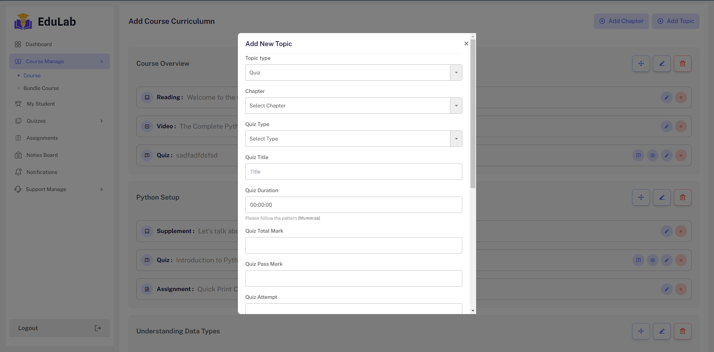
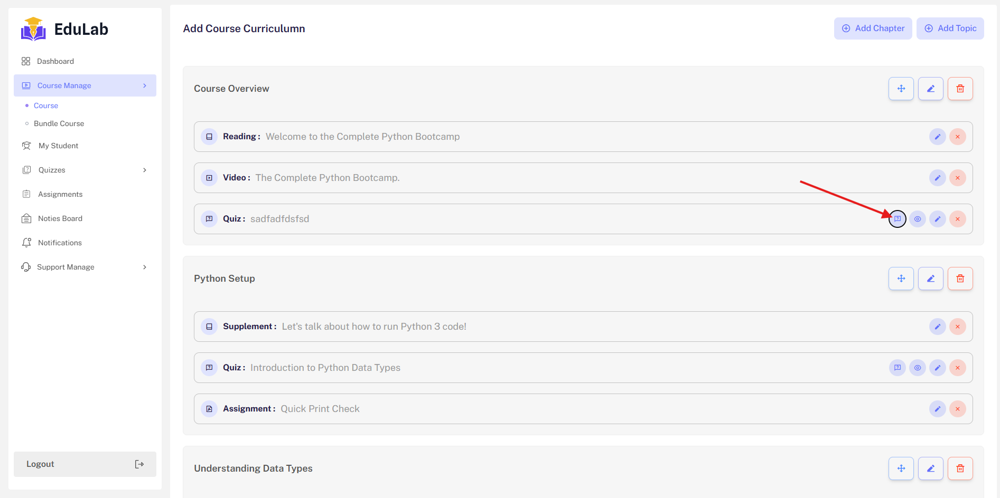
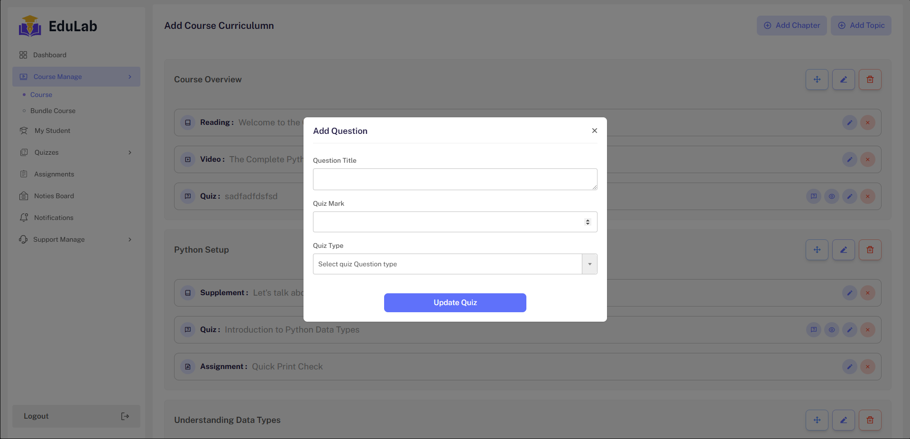
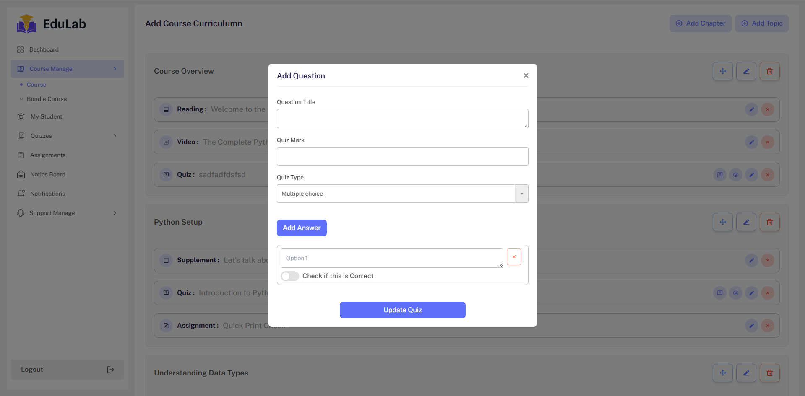
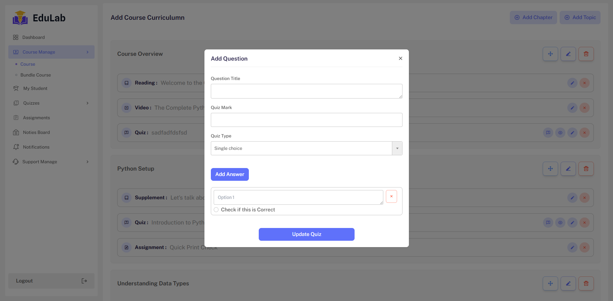
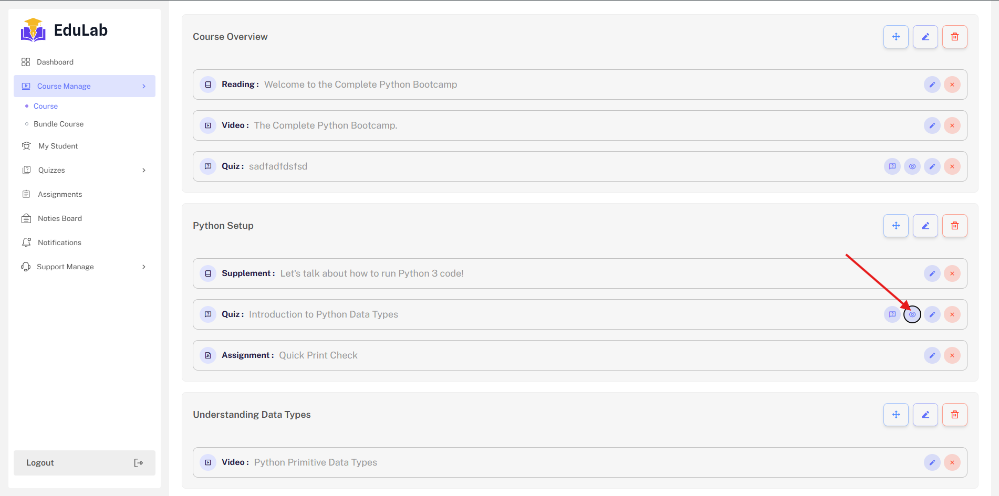
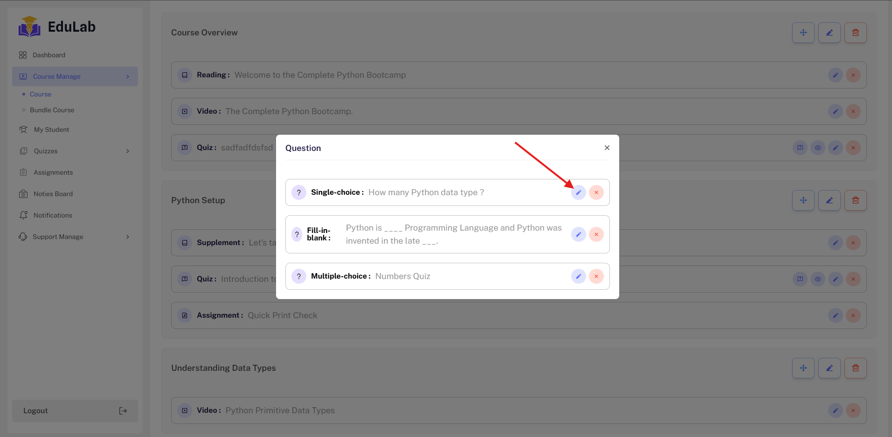
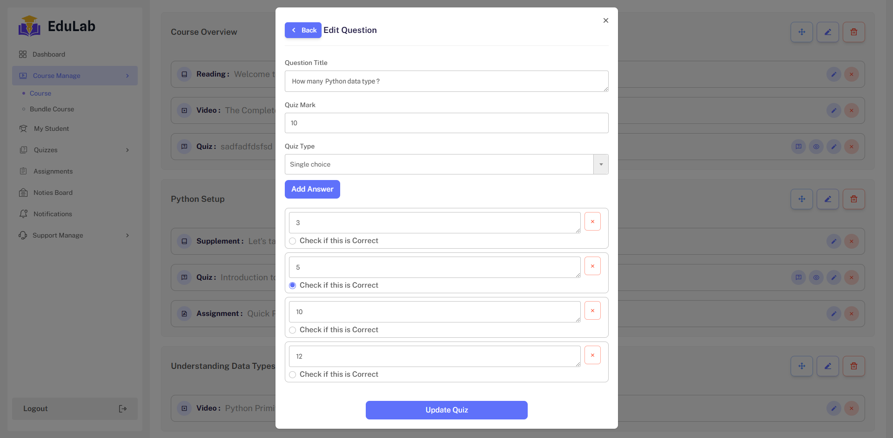

## Quiz Create

Login as Instructor->Course->Course Edit -> Curriculum -> Topic Type Quiz



## Question Add

After creating the basic Information , need to add quiz Question and Question answer. Click on button You will see form modal and
some field

```
 Question Title
 Question Mark
 Question Type - Multiple choice , Single choice and Fill in the Blank.

```





## Multiple choice

When select multiple choice and you can add multiple answer and checked correct answer.



## Single choice

When select Single choice and you can like this.



## Question List

After Creating all type of question. you will see the list on click





