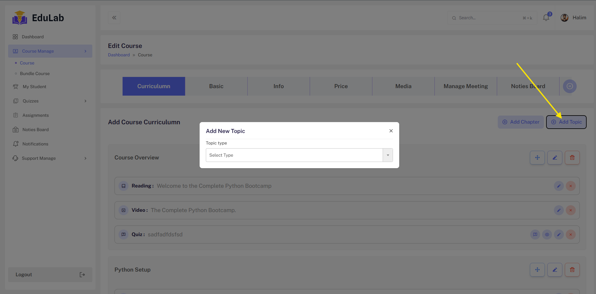
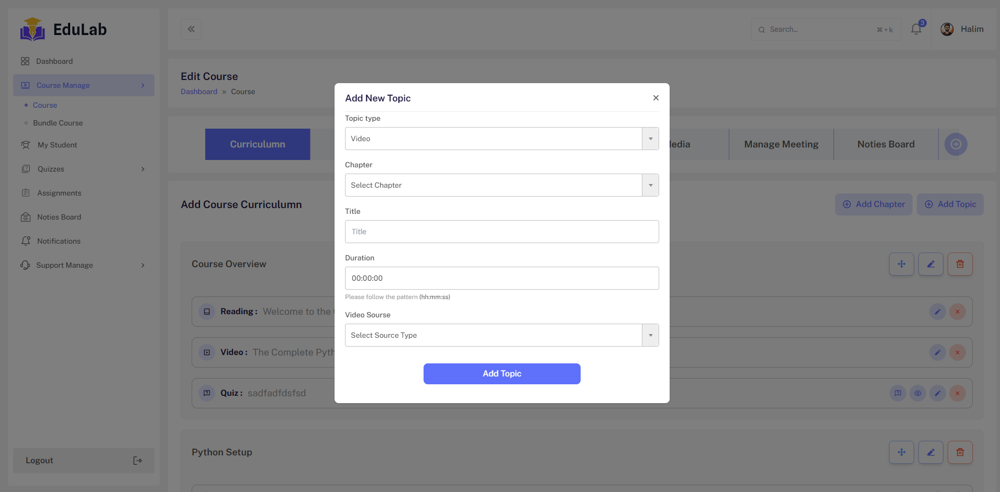
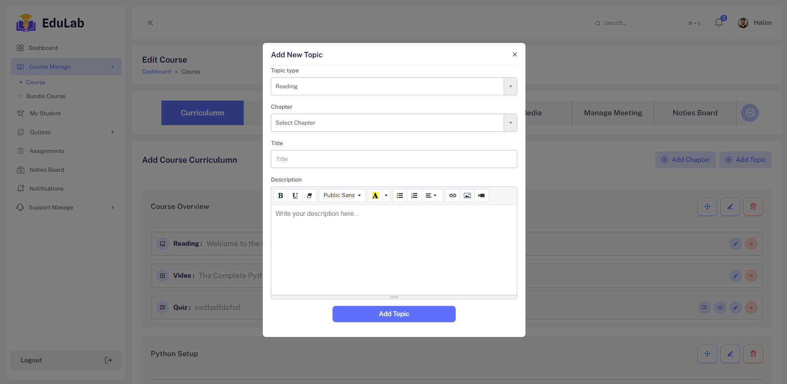
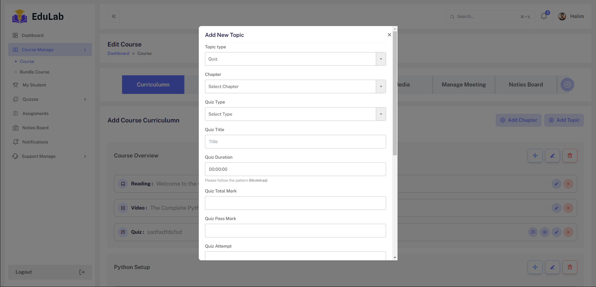
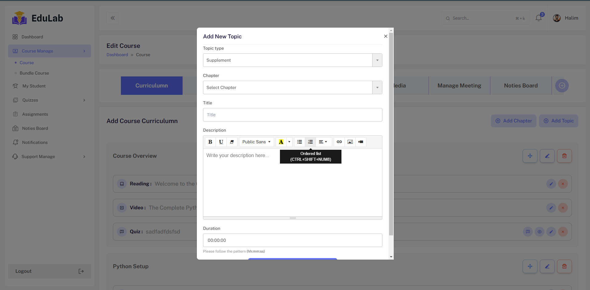
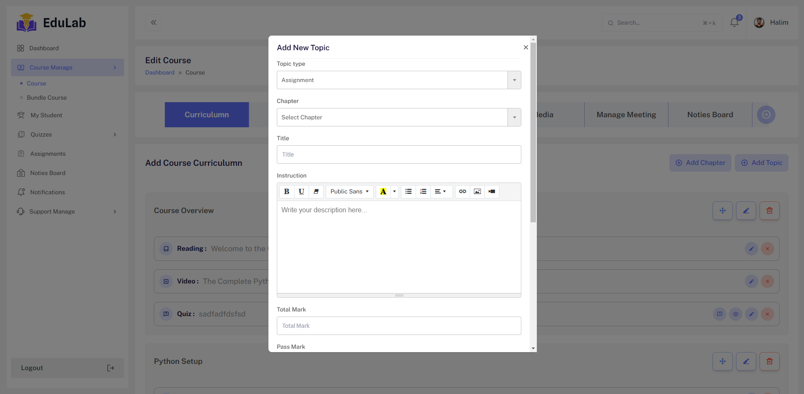
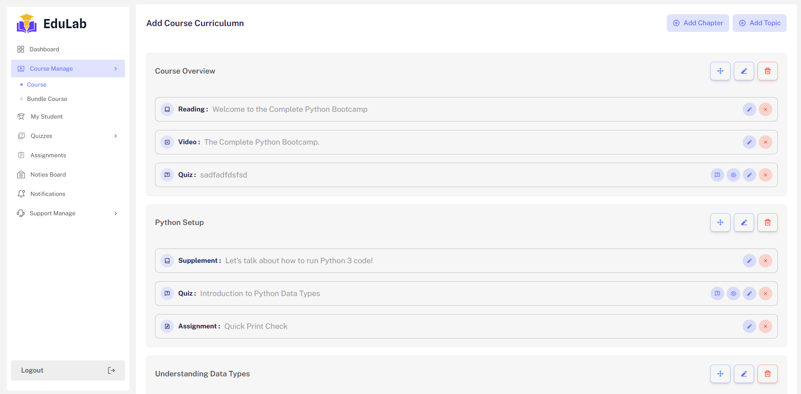

## Topic Type

Go to Instructor->Course Edit -> Curriculum

After Creating Course Chapter. When Creator want to add Topic under Chapter. Click On `Add Topic`
Will be showed Model and Some Topic Type . Such as

<pre>
    Video 
    Reading 
    Quiz
    Supplement
    Assignment 
</pre>

## Video

When Creator select Video Type , show the form like image

## Reading

When Creator select Reading Type , show the form like image

## Quiz

When Creator select Quiz Type , show the form like image

## Supplement

When Creator select Supplement Type , show the form like image

## Assignment

When Creator select Assignment Type , show the form like image

## Topic List

When Creator add different type of data, then show the list like this Image and also can specific topic edit , sorting

